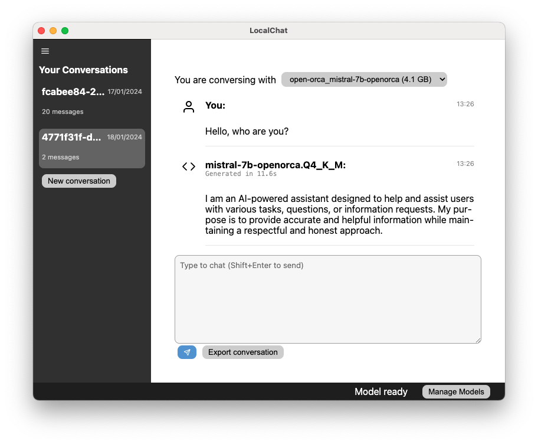

<p style="text-align: center;">
  
</p>

<p style="text-align: center;">
  <a href="#quick-start">Quick Start</a> |
  <a href="#documentation">Documentation</a> |
  <a href="#finding-models">Finding Models</a> |
  <a href="#some-model-recommendations">Model Recommendations</a> |
  <a href="#support--questions">Support &amp; Questions</a>
</p>

# Overview

LocalChat is a privacy-aware local chat bot that allows you to interact with a broad variety of generative large language models (LLMs) on Windows, macOS, and Linux. Imagine ChatGPT, but without the for-profit corporation and the data issues.



# Quick Start

To get started with LocalChat, head over to <https://github.com/nathanlesage/local-chat/releases> and download the most recent release for your operating system. LocalChat supports macOS (10.15 or newer; both Intel and Apple Silicon), Windows (10 or newer; only x86), and Debian-based Linux (x86 and ARM 64bit). If you have experience building Electron-apps, you may also build it manually for other platforms.

> Note: The Windows binary has not been code signed. This means that Windows will complain and try to convince you not to open the file. As long as you downloaded the file from the GitHub releases page, you can safely open the file.

After installing the app, carefully read the first start guide. Then, open the Model Manager from the statusbar, and follow the guidelines to download your first model. See below for some recommendations. Paste the link to the model file into the text field and start the download. Depending on the model size, this may take quite a while, but the app will show you the progress. You can close the model manager now.

After the model has finished downloading, you can create a new conversation. Now you're done and you can start chatting.

# Documentation

## Managing Conversations

Conversations are the core of LocalChat. You can create as many as you need, and continue them as you please. Before being able to chat you first need to create a new conversation. A new conversation will use the last loaded model (if available), or the first found available model in the model directory. You cannot create conversations unless you have at least one model available.

Conversations are identified with a UUID4 hash. Click on any conversation to open it in the chat view. When you hover over a conversation, you will see a "Delete" button that you can use to remove a conversation.

When a conversation is open, you can change the model that is being used to chat with the dropdown at the top. Note, however, that this may under certain circumstances lead to weird responses by the new model (which has not generated the previous answers).

Lastly, you can export any conversation by clicking the appropriate button below the prompt text area. Choose a location and a filename. The conversations will be exported as Markdown.

## Chatting

Chatting works basically as you would expect it: Below the conversation, there is a text area where you can write your message. Create linebreaks by pressing Enter. You send a message with Shift+Enter, or by clicking the small send-button below the text area. Lastly, you can use basic Markdown syntax to format your message. Most models have been trained on something Markdown-like, and indeed will generate simple Markdown syntax, which LocalChat will automatically render appropriately.

After you've sent a message, the selected model will begin to generate a response. This works by first parsing in the entire past conversation, and then generating new tokens. As soon as the model has finished digesting the previous conversation, you will see that its message is being constructed token for token.

The model should automatically stop generating after a reasonable amount of text. However, there are instances where the utilized chat template may not match the model's training experience. If the model starts outputting weird text, you can abort generating by clicking the abort button below the chat, or in the status bar.

## Managing Models

The model manager can be opened by clicking the button in the status bar. Here you can download new models, configure the existing ones, and open the model directory. All models are saved into your user data folder. The exact path depends on your platform.

LocalChat will attempt to read any metadata contained in the GGUF files, which can take some time, since the files are comparatively large. Finally, in the model manager, you can configure the models. Specifically, you have two important settings available: the prompt template and the context size.

### Selecting an appropriate Prompt Template

Each conversation requires a prompt template that wraps your questions and the model's responses in a format that the model can actually generate a reply to. For example, the general template looks like this:

```
### User

{user_message}

### Assistant

{assistant_message}
```

The prompt template must match what the model has been trained on so that (a) the model will understand what you are asking it, and (b) the wrapper is able to stop the generation once the model has emitted the appropriate tokens.

The default is to automatically detect a prompt template, but this may not work perfectly for each model. For example, Mistral's OpenOrca 7b model, the OpenChat 3.5 model, and TinyLlama v1.0 all follow the Llama architecture so LocalChat will select the Llama prompt template, which will cause the models to behave erratically. Instead, they need the "General" template, so you'll have to configure this.

### Selecting an appropriate context size

The context size is the maximum length of each conversation a model has been trained on. Context sizes can vary from 2,048 tokens up to 100,000 tokens or more (each word corresponds roughly to 0.75 tokens, so 2,048 tokens equal approximately 1,500 words). In simple terms, a longer context size requires more memory, but allows you to have longer conversations.

LocalChat will, for every model, default to 2,048 tokens, even if the model supports more. The reason is that some model files may "lie" about the context size (see the section on quantized models below), and if you choose a context size too large, the app may crash or cause other problems. You can try to increase the context size. If you select a too-large context size and then immediately load the model (either by switching the current conversation's model, or loading a conversation with said model), the app will crash. After a crash, any changes are not saved, so you should be safe.

If everything goes wrong and the app has saved wrong settings that will cause crashes, remove the file `model-config.json` from the application data folder.

### A Note on Quantized Models

The real star of the show that allow apps such as LocalChat is the discovery of quantization. Generative LLMs are still very large, and often too large for regular consumer hardware such as your laptop or Desktop PC. However, research has found that you can safely reduce the precision of the model weights without losing too much of the capabilities of the model.

By default, LLM weights are stored in "16 bit floating point" precision. This means that each individual weight will be 16 bit large. Quantization allows to cut down the amount of memory each weight requires down to 2-5 bits. To give you an easier to understand example, one weight may be `0.1843123612`, which after quantization becomes `0.18431`. This allows models of, e.g., 16 GB, to be reduced down to, e.g., 3 GB. The former, full 16 GB hardly fit into any GPU memory, but 3 GB are much more common, so you'll be able to run those on your computer.

However, another technique to reduce the memory requirements of models is to reduce their context size. An (infamous) example is Mistral's OpenOrca 7b model. Originally trained on a context size of 32,768 tokens (32k), the quantized model by "TheBloke" has a context size of only 2,048 tokens. The issue now is that the GGUF file's metadata still reports a context size of 32,768. Using this context size, however, will crash the app. This is the reason why all models are initialized with a context size of 2,048 by default, since there are hardly any quantized models that have a smaller context size.

## Finding models

Finding models requires a little bit of research. Below I have listed a set of models I personally found good and simple to run.

Unless you have an industry-standard GPU such as a P40 or even an A100, you will probably have to use quantized versions of the models. Luckily, most GGUF-files contain quantized models, not the full ones. At the time of writing, the most prolific quantizer is "TheBloke" on Huggingface. If you visit <https://huggingface.co/models?sort=trending&search=gguf>, you will see all models in GGUF format, and likely many by "TheBloke".

If you now visit, e.g., [TheBloke's quantized OpenChat 3.5 model](https://huggingface.co/TheBloke/openchat-3.5-0106-GGUF), you will see the model's README file (model card). "TheBloke" is a good source for models, since they always include [a table of all quantized files](https://huggingface.co/TheBloke/openchat-3.5-0106-GGUF#provided-files) including a description of how much the quantization has impacted their performance. Other providers may not include such a description, but with a little bit of experience, it should be easy to judge which quantization method has which effects.

## Some Model Recommendations

[Mistral OpenOrca 7b](https://huggingface.co/TheBloke/Mistral-7B-OpenOrca-GGUF)

: I found this model offers a good balance between performance and quality. It comes in various sizes, and the "recommended" quantized one performs very well.

[OpenChat 3.5](https://huggingface.co/TheBloke/openchat-3.5-0106-GGUF)

: A larger model than Mistral's 7b OpenOrca one. Despite being a bit slower in generating responses, it is a bit better in handling non-English questions.

[TinyLlama v1.0 1.1b](https://huggingface.co/TheBloke/TinyLlama-1.1B-Chat-v1.0-GGUF)

: As the same suggests, a very tiny model. My own laptop can handle the full model quite well, and indeed, the first version on LocalChat, which was still based on PyTorch and Huggingface Transformers, ran on TinyLlama. It has a bit worse quality than the other two models, but if you have slower hardware that cannot run even the quantized versions of OpenOrca or OpenChat, TinyLlama may suit you well.

## Support & Questions

For me, LocalChat is a hobby project, and I have a ton of work elsewhere. This means that I would like to ask you not to expect any progress. I will try to keep it updated and fix bugs, but I will not give any guarantee. If you find a bug, or have an improvement suggestion, feel free to open an issue, but I may never respond, depending on how life goes.

If you want to contribute and make LocalChat better, please feel free to open a Pull Request. A well-designed PR has a much higher chance of me reacting, approving, merging, and releasing changes that come in the form of a PR, simply because I don't have to do the implementation. Even if you're unsure if your PR is "good", open it – the likelihood of me telling you where I think it needs improvement is still higher than reacting to issues.

## Final Thoughts

If LocalChat works for you and you enjoy it, feel free to give a shoutout `@hendrikerz.bsky.social` (Bluesky) or `@hendrikerz@scholar.social` (Mastodon), or [tip me on PayPal](https://www.paypal.me/hendrikerz). The latter is mainly important since I provide the Zettlr code signing certificates for LocalChat as well, and those cost (a lot of) money.

Also, have a look at [Zettlr](https://www.zettlr.com), my main project that I usually work on.

Have a nice day!
